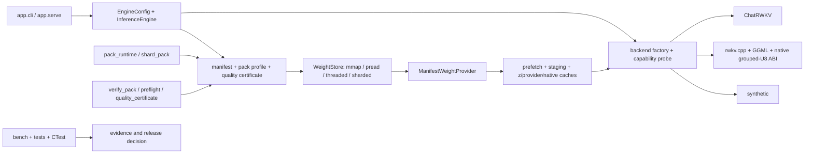

# Repository audit

Audit date: **2026-08-04**
Scope: working tree at `main`, including the Python engine, local serving
surface, native/submodule paths, pack and quantization flow, benchmarks,
deployment examples, tests, research artifacts, and documentation.

This is an audit of the current checkout and its release boundary. Source and
documentation remediation is committed in the superproject; model payloads
and generated benchmark output remain local and ignored. No reset, checkout,
or broad file move was performed.

## Executive verdict

The repository is fit for a **constrained CPU/reference release** when the
operator pins the exact checkpoint, pack, native library, and host profile. It
is not fit to advertise as a general production inference platform yet.

The strongest path is the CPU `rwkv.cpp` resident path with a matching GGML
model, backed by ChatRWKV as the quality/reference implementation. The default
compact 2.9B selector now resolves to the grouped-U8 g32 pack, and that exact
selector has a manifest-bound three-prompt logits/state smoke certificate. The
certificate is valid for its declared scope; it is not evidence for long
generation, broad prompt coverage, or an SLO.

The release boundary is therefore:

| Surface | Audit result | Meaning |
|---|---|---|
| Synthetic CPU engine | **Green** | Deterministic correctness and CI golden path. |
| ChatRWKV CPU resident/streaming | **Green/amber** | Reference-quality path with broad local regression coverage; real-model and host-specific. |
| `rwkvcpp` resident CPU | **Green/amber** | Best real CPU deployment candidate; matching GGML and native build are required. |
| `rwkvcpp` grouped-U8 streaming | **Amber** | Default compact direction; short-smoke certified and native memory/throughput-gated, but long-run quality is open. |
| Local HTTP service | **Amber** | Bounded local service with workers, sessions, cancellation, and metrics; not an internet-facing deployment. |
| XPU | **Amber/red** | LUT decode is implemented and hardware evidence exists, but matrix compute is unavailable on the audited host and grouped-U8 is not supported there. |
| CUDA/GDS/MPS | **Red** | Roadmap/research boundary; no local production gate. |
| Albatross | **Amber/red** | Layer-wise CUDA pack adapter is wired to the shared provider and F1-F5 lifecycle; external checkout, compatible variant, CUDA, tokenizer, and quality/throughput gates remain required. |

The three issues that must be closed before calling this a reproducible public
release are:

1. Publish the dependency/submodule state. `.gitmodules` is now committed and
   the submodules are cleanly pinned locally, but no remote is configured for
   the newly created nested commits.
2. Extend the grouped-U8 default certificate to held-out prompts and sustained
   generation, then record the exact checkpoint, tokenizer, pack, native ABI,
   and host in a release artifact.
3. Define a real distribution/deployment boundary: model artifact delivery,
   native binary provenance, CI asset policy, and a gateway/TLS/rate-limit
   story for anything beyond localhost.

## Architecture map

The code is organized around one engine contract with multiple execution
families. A model is not production-qualified merely because its backend can
be imported: the effective capability is the intersection of backend, model
family, device, mode, pack codec, native ABI, and quality certificate.

### Runtime layers

| Layer | Primary paths | Responsibility | Current state |
|---|---|---|---|
| Application entry points | `app/cli.py`, `app/engine_args.py`, `app/serve.py`, `app/worker_pool.py` | CLI configuration, local OpenAI-compatible HTTP, bounded process workers, sessions, cancellation, sampling, metrics | Active and tested; service boundary is local-only. |
| Engine orchestration | `rwkv_ssd/runtime/engine.py`, `config.py`, `errors.py`, `provider_factory.py` | Load validation, mode/device dispatch, backend lifecycle, generation contract, state transfer | Active core; large central module remains a maintenance hotspot. |
| Pack identity and safety | `manifest.py`, `pack_verify.py`, `quality_certificate.py`, `pack_profiles.py`, `preflight.py` | Versioned tensor layout, path/hash validation, profile resolution, manifest-bound quality gates | Strong structural and certificate gates; model artifacts remain local. |
| Storage and streaming | `weight_store*.py`, `io_*.py`, `layer_io.py`, `prefetch.py`, `staging.py` | mmap/pread/threaded reads, striped shards, layer spans, prefetch, staging | CPU paths are implemented and heavily unit-tested; Linux io_uring is a separate research artifact. |
| Residency and caches | `residency.py`, `ram_budget.py`, `stream_cache_policy.py`, `weight_provider.py`, `decode_*`, `state_*`, `snapshot.py` | RAM tiers, provider/z/native caches, disk decode/state caches, snapshots and parking | Broad CPU contract coverage; large-model physical scaling remains unvalidated. |
| Codec and execution kernels | `pack_codec.py`, `trinity_*`, `dequant.py`, `lut_*`, `packed_block_forward.py`, `rwkv7_linear.py` | Dense, scale-U8/U4, grouped-U8, LUT2, fused GEMV and packed block execution | Dense and grouped-U8 paths are the current direction; all-LUT2 real-model quality is blocked. |
| RWKV model execution | `rwkv7_forward.py`, `rwkv7_batch.py`, `rwkv7_skeleton.py`, `rwkv7_weights.py`, `deepembed.py` | RWKV-7 resident/streaming, batching, skeleton loading, DeepEmbed variants | Active CPU/reference path; fused qkv/DEA production path remains open. |
| Native integration | `rwkv_ssd/native/`, `runtime/ggml_*`, `backends/rwkvcpp.py`, `backends/rwkvcpp_ref/` | Windows LUT2 gather, GGML bridge, layer-local ABI, grouped-U8 upload | Locally functional and cleanly pinned; public reproducibility awaits publication of the nested commits. |

## Path-by-path progress and readiness

### Active product paths

| Path | Progress | Evidence | Production fit |
|---|---|---|---|
| `rwkv_ssd/` | Main engine, pack tools, codecs, backends, runtime controls, and metrics are implemented. | Full Python suite, compile check, pack/security tests, and focused serving/native tests. | **Constrained CPU release candidate**, not a broad platform release. |
| `app/cli.py` | Configuration and launch path for resident, partial, and streaming modes; real CPU default is `rwkvcpp`. | CLI/config tests and synthetic end-to-end tests. | **Usable locally**; exact model/native prerequisites must be documented per deployment. |
| `app/serve.py` | OpenAI-compatible `/v1/chat/completions`, `/v1/completions`, `/v1/models`, `/health`, `/metrics`. | Serving tests cover auth/CORS controls, body limits, sessions, streaming, sampling, and metrics. | **Local/private-network only**. No TLS, external rate limiting, multi-host orchestration, or hardened gateway. |
| `app/worker_pool.py` | Spawned workers own independent engines; parent routes sessions, state envelopes, cancellations, health, and restart. | `tests/test_worker_pool.py` and worker-pool HTTP integration tests. | **Promising local service boundary**; still needs load, crash, and RSS qualification with the actual target model. |
| `rwkv_ssd/tools/pack_runtime.py` | Packs RWKV PyTorch/safetensors inputs and records model-family metadata. | Pack, safetensors, codec, and RWKV family-detection tests. | **Tooling-ready**; generated packs are not distributed by the Python wheel. |
| `rwkv_ssd/tools/verify_pack.py` / `preflight.py` | Structural offsets, hash, path containment, backend assets, native assets, and certificate checks. | Pack verification, path-security, preflight, and quality-certificate tests. | **Required release gate**, provided the exact artifacts are supplied. |
| `rwkv_ssd/runtime/quality_certificate.py` | Binds metrics to manifest identity, metadata identity, and every declared artifact hash. | Certificate issue/verify tests and current 2.9B certificate. | **Good control**, but certificate scope must be expanded before a broad quality claim. |

### Backend families

| Backend/family | Implemented behavior | Tested/qualified boundary | Open work |
|---|---|---|---|
| `synthetic` | Deterministic resident/partial/streaming pack execution, batching, sampling, state, and metrics. | Full CPU unit/e2e golden coverage. | Not a language-model quality or performance baseline. |
| `chatrwkv` | RWKV-7 PyTorch resident and pack-streaming path, F tiers, state cache, batching, DeepEmbed handling, CPU/XPU split. | Strongest reference for pack parity; real fixtures are opt-in/asset-dependent. | More sustained real-model qualification and a fused qkv/DEA production path. |
| `rwkvcpp` resident | Native GGML resident inference with matching converted `.bin`; explicit native thread policy and state/snapshot bridge. | Native CTest 8/8; local real-model comparisons; backend tests. | Pin and publish the exact native ABI/source revision and conversion recipe. |
| `rwkvcpp` provider streaming | Layer-local native plan, provider upload, persistent/transient dense borrowing, native cache accounting, grouped-U8 packed-only graph. | 0.1B conformance/F-tier gates and 2.9B native throughput/memory gates. | Long-run quality, cold-start/prefill/concurrency SLOs, and clean dependency provenance. |
| `albatross` | External layer-wise CUDA adapter over `ManifestWeightProvider`; dense materialization supports the existing pack codecs and F1-F5 cache lifecycle. | Static/import checks and explicit unavailable errors on CPU; CUDA execution is not locally tested. | Compatible Albatross checkout, greedy parity, sustained quality/throughput, and CUDA memory gates. |
| external engines | `app/lightning_proxy.py` is an HTTP proxy/reference hook, not an in-process backend. | No engine quality claim. | Treat as an integration boundary with its own service/SLO contract. |

### Device and accelerator paths

| Device/path | What the source actually does | Readiness |
|---|---|---|
| CPU | Primary implementation for ChatRWKV, rwkv.cpp, synthetic, provider, and native grouped-U8. | **Current release scope**, with model/pack-specific qualification. |
| Intel XPU | Probes runtime and matrix compute separately; can use XPU for LUT2 decode while falling back to CPU model compute when matrix engines fail. CPU-reference and fallback tests are broad; opt-in hardware tests are skipped when XPU is unavailable. | **Experimental/hardware-gated**. Not a grouped-U8 production path. |
| CUDA | Device selection/fallback and some staging/decode abstractions exist; no audited production model/backend gate. | **Roadmap/hardware-gated**. |
| GDS / io_uring | Documented and simulated/researched, but `check_backends` reports `io_uring_engine: false`; engine I/O is mmap/pread/threaded. | **Research only**. |
| MPS/Metal | Mentioned in roadmap/vendor references, but no local release gate or engine qualification. | **Unsupported claim**. |

## Pack and quantization audit

The pack path has a useful separation between structural validity and model
quality:

1. `pack_runtime` creates tensor records and payloads.
2. `Manifest` resolves tensor names, shapes, codec, offsets, residency, and
   optional shard files.
3. `verify_pack` checks version, bounds, alignment, hashes, and declared files.
4. `quality_certificate` binds the manifest, `meta.json`, and declared artifact
   hashes to measured metrics and gates.
5. `pack_profiles` resolves the requested selector; the 2.9B `auto` selector
   redirects to `runtime_pack_2.9b_grouped_quality` only when its certificate is
   present. Explicit legacy profiles are not silently rewritten.
6. `preflight` checks the resolved profile plus backend/native/GGML prerequisites.

The current compact direction is the promoted grouped-U8 policy. The exact
prepared pack supplied by the operator must carry a manifest-bound certificate
covering its checkpoint, tokenizer, prompts, metrics, and all declared
artifacts. The audit accepts the promotion decision only for that declared
scope; a prior larger group exceeded the configured KL gate, so this is a
quality improvement direction, not a claim that all grouped quantization is
safe or faster than the resident reference.

The old all-LUT2 2.9B application-quality path remains correctly blocked. A
structurally valid pack, a fast decode result, or a storage ratio is not enough
to promote a lossy pack.

## Evidence, tests, and benchmarks

### What is covered

The repository has unusually broad contract coverage for the CPU engine:

- full Python collection currently contains **595 tests**;
- the latest current full local gate is **577 passed, 18 skipped in 173.91 s**
  using `pytest --override-ini "addopts="`; the slowest calls are the
  RWKV7a DeepEmbed parity checks (55.31 s and 32.49 s), so a short CI timeout
  is not an adequate full-gate budget;
- the default marker gate intentionally deselects asset-heavy/slow classes;
- focused current checks include pack verification, preflight, parity,
  serving, worker pool, sampling, state envelopes, memory accounting, and
  grouped/native bridge behavior;
- `compileall`, `pip check`, wheel inspection, JSON parsing, and `git diff
  --check` have passed in the current remediation record;
- the former vendored native **8/8** record is historical and does not qualify
  the newly pinned public upstream revision.

The test suite proves code contracts, not universal hardware support. Real
checkpoint tests are often skipped unless local `.pth`, `.bin`, or
native assets exist. The CI workflow explicitly makes several real-model and
native evidence steps conditional on those assets, so a green CI run can still
be a synthetic/contract run.

### Benchmark organization

| Location | Role | Audit treatment |
|---|---|---|
| `bench/bench_f1_f3.py`, `bench_throughput.py`, `bench_streaming_matrix.py`, `bench_io_ceiling.py` | Active production-facing CPU measurements | Use only with complete metadata and exact model/pack identity. |
| `bench/bench_backend_conformance.py`, `bench_rwkvcpp_quality.py` | Parity and quality evidence | Appropriate for promotion decisions; short smokes remain explicitly scoped. |
| `bench/results/` | Current machine-readable evidence | Current and historical files coexist; status pages identify which result is authoritative. |
| `bench/results/archive/` | Debug and superseded runs | Correct location; do not use for current headline numbers. |
| `archive/bench/` | Superseded scripts and legacy comparisons | Historical only. |
| `simulations/` | Feasibility/thesis simulations and CSV outputs | Not inference code, not CI, not production evidence. |
| `storage_bench/` | Linux Rust `io_uring` sequential-read ceiling | Not the engine I/O path; useful for future Linux work. |
| `papers/` | Optional LaTeX research drafts and PDFs | Not implementation or release evidence. |

Every new headline result should satisfy the policy in `bench/RESULTS.md`:
fixed checkpoint/prompt/token count/sampling, at least 16 tokens and two
samples where practical, separate decode-only from end-to-end rate, and
explicit quality or `not measured` status.

## Repository organization audit

The current top-level organization is reasonable and should be preserved:

| Directory | Keep as | Notes |
|---|---|---|
| `rwkv_ssd/` | Active library | Source of truth for runtime and tools. |
| `app/` | Active product surface | CLI and local serving only. |
| `tests/` | Active gates | Keep real-asset tests marked and opt-in. |
| `bench/` | Active evidence producers | Keep scripts flat for command compatibility; use catalog/results policy. |
| `deploy/` | Example configs | Examples are not hardened production manifests. |
| `docs/` | Canonical status and runbooks | `PROJECT_STATUS.md` remains recommendation source; this file is the audit source. |
| `backends/rwkvcpp_ref/` | Vendored submodule | Must be pinned and clean/reproducible before release. |
| Operator model/output directory | User-supplied checkpoints and packs | Never assume a source clone contains model artifacts; keep them outside the source distribution. |
| `archive/` | Historical material | Do not re-import archived code or numbers without requalification. |
| `research/`, `simulations/`, `storage_bench/`, `papers/` | Non-product research | Keep clearly labeled and out of production status tables. |
| `.venv-*`, `build/`, `.pytest-*`, `*.egg-info/` | Generated local state | Correctly ignored; do not treat as repository source. |

No broad physical move is justified by this audit. Moving active scripts would
break documented commands and would not fix the deeper reproducibility and
qualification gaps. Indexes, archive labels, and evidence metadata are the
safer organization mechanism.

### Working-tree and dependency hygiene

The audit found the following state that should be visible to release managers:

- the superproject pins `backends/rwkvcpp_ref` at the reachable upstream
  commit `14663c83b6aba4885a47c1fba91204efc74a49d3`;
- the superproject pins the ChatRWKV submodule at the reachable upstream
  commit `2e2bb1cd390cefbedae0a89f4a343f6f754d6621`;
- `.gitmodules` is committed with explicit mappings for both gitlinks, so a
  clone has a deterministic submodule layout;
- promoted packs and checkpoints are local/ignored artifacts. A wheel or
  source checkout does not provide them; use [`MODEL_IMPORT.md`](MODEL_IMPORT.md).
- both submodule gitlinks point to commits that are available from their
  configured upstream remotes, so a fresh external clone can initialize them.

The submodule source is now clean and reproducibly pinned. Model, tokenizer,
pack, GGML, and native binary artifacts remain local/ignored and are documented
in [`MODEL_IMPORT.md`](MODEL_IMPORT.md).

## Documentation audit

The canonical navigation now is:

1. [`README.md`](../README.md) for the first-run and release boundary;
2. [`REPO_LAYOUT.md`](../REPO_LAYOUT.md) for the compact file map and local
   artifact policy;
3. [`PROJECT_STATUS.md`](PROJECT_STATUS.md) for current recommendations and
   measured status;
4. [`BACKENDS.md`](BACKENDS.md), [`PRESETS.md`](PRESETS.md), and
   [`HTTP_SERVING.md`](HTTP_SERVING.md) for operator paths;
5. [`ENGINE_EVALUATION_REPORT.md`](ENGINE_EVALUATION_REPORT.md) for the
   remediation record;
6. this document for the path/readiness audit;
7. [`archive/README.md`](../archive/README.md) for superseded material.

The active navigation links resolve locally. A repository-wide historical-link
scan still finds references in old changelog/archive documents to files that
were moved or never existed, including the old planning and Albatross notes.
Those links do not affect runtime, but they should either be redirected to the
archived path or labeled as historical in a later documentation cleanup. The
milestone ledger also contains older snapshot counts; its current gate is the
August 24, 2026 **577/18** Python record. Native qualification must be rerun
against the newly public upstream submodule pin before publishing a new CTest
count.

## Production acceptance plan

Before promoting a general release, close these gates in order:

1. **Reproducible source:** commit `.gitmodules`; pin the exact submodule
   revisions containing the native ABI; make the ChatRWKV dependency strategy
   explicit; build native binaries from a clean checkout.
2. **Reproducible artifacts:** publish a model/pack manifest with checkpoint,
   tokenizer, pack, GGML, native DLL, compiler, and host hashes. Make the
   default selector fail with a clear install message when the local artifact
   is absent.
3. **Default compact quality:** run the g32 selector on held-out prompts and
   sustained generations (not only three short probes), compare greedy and
   sampled behavior to the resident reference, and issue a new certificate
   with the complete scope.
4. **Runtime SLOs:** measure cold load, prompt prefill, warm decode, p50/p95
   inter-token latency, RSS high-water, concurrent requests, cancellation,
   restart, and disk-class dependence for the exact deployment profile.
5. **Service hardening:** keep the current implementation behind localhost or
   an authenticated private gateway until TLS, external rate limiting,
   request quotas, access logging, and multi-host failure behavior are owned by
   the deployment layer.
6. **Platform claims:** run separate CUDA/GDS/XPU/MPS acceptance suites before
   changing any hardware-gated status to supported.

## Recommended next actions

**P0 — release reproducibility**

- Publish the two pinned submodule commits to accessible remotes (or vendor
  the required native/ChatRWKV source into the main project) before cutting a
  public release. The local superproject pins are now clean and explicit.
- Produce a clean-checkout CI job that does not depend on ignored local model
  files and reports real-asset gates as `not run`, not as production evidence.

**P1 — default quality and deployment**

- Extend the g32 certificate to held-out/sustained generation and publish the
  exact artifact manifest.
- Add a release-pack acquisition/verification workflow for any promoted model;
  operator model directories are not a distribution channel.
- Add load/concurrency/RSS benchmarks for `app.serve` with the target native
  model and document the supported private-network boundary.

**P2 — maintainability and documentation**

- Consolidate historical changelog links under `archive/` or replace them with
  current canonical documents.
- Keep `PROJECT_STATUS.md` as the only current recommendation table; mark all
  milestone/roadmap numbers as dated snapshots.
- Add optional lint/type/security tooling to CI (`ruff`, `mypy`, `bandit`, and
  dependency auditing) after selecting compatible configurations.

Until P0 and P1 are closed, the accurate product statement is: **a well-tested
CPU-first research/engineering engine with a constrained local release path,
not a generally production-ready multi-accelerator serving platform**.
